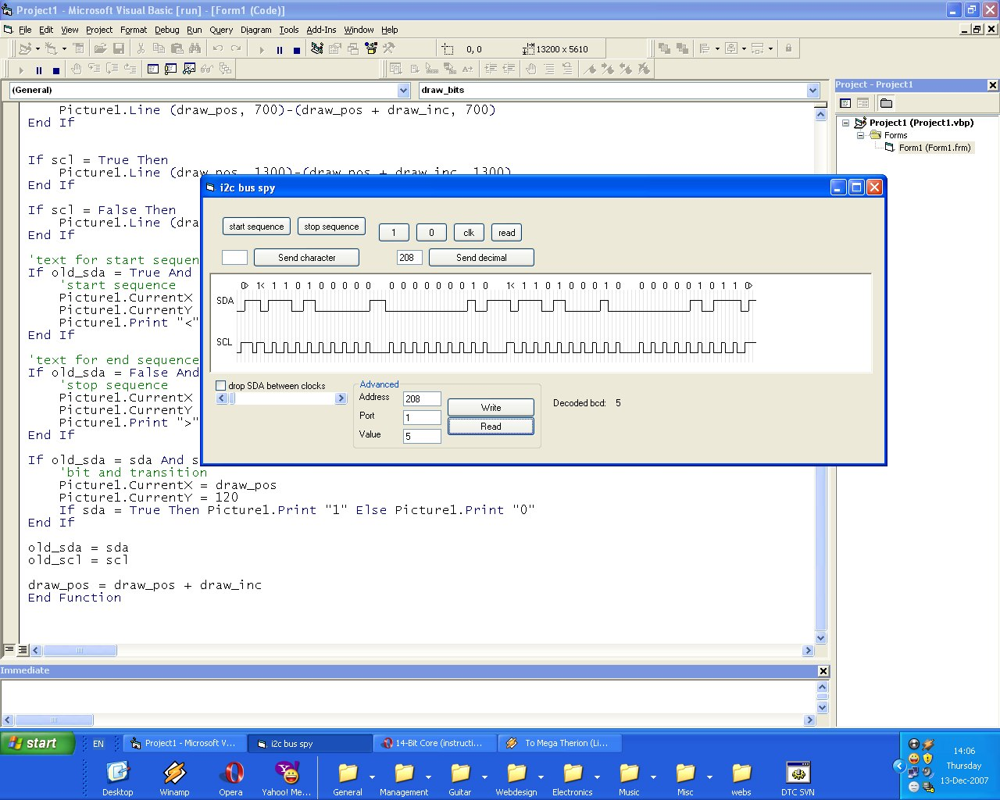



## i2c interface pic 16f628

### Description

ever wanted to play around with i2c at low level? or just want to see how a pic compiler actually does that uber-cool and uber-quick i2c routines?

this piece of software can help you. you'll need a pic16f628, a serial level converter (max232, you should have one if you call yourself a pic developer).

i used this to toy around with a ds1307 real time clock. the code isn't very commented, but you should see what's going on from the routine name. also included: schematic done in pcb software XD (needs express pcb to open), mplab project (needs mplab).

hope it helps somehow. if you do something interesting with it, let me know. i'm thinking of making a whole suite of emulated i2c devices, that can be accessed from microcontrollers.
 
### More Info
 

             |
---                |---
**Submitted On**   |2007-12-13 07:20:02
**By**             |[\_izua\_\_](https://github.com/Planet-Source-Code/PSCIndex/blob/master/ByAuthor/izua.md)
**Level**          |Beginner
**User Rating**    |5.0 (15 globes from 3 users)
**Compatibility**  |VB 6\.0
**Category**       |[Complete Applications](https://github.com/Planet-Source-Code/PSCIndex/blob/master/ByCategory/complete-applications__1-27.md)
**World**          |[Visual Basic](https://github.com/Planet-Source-Code/PSCIndex/blob/master/ByWorld/visual-basic.md)
**Archive File**   |[i2c\_interf20936912132007\.zip](https://github.com/Planet-Source-Code/izua-i2c-interface-pic-16f628__1-69757/archive/master.zip)

